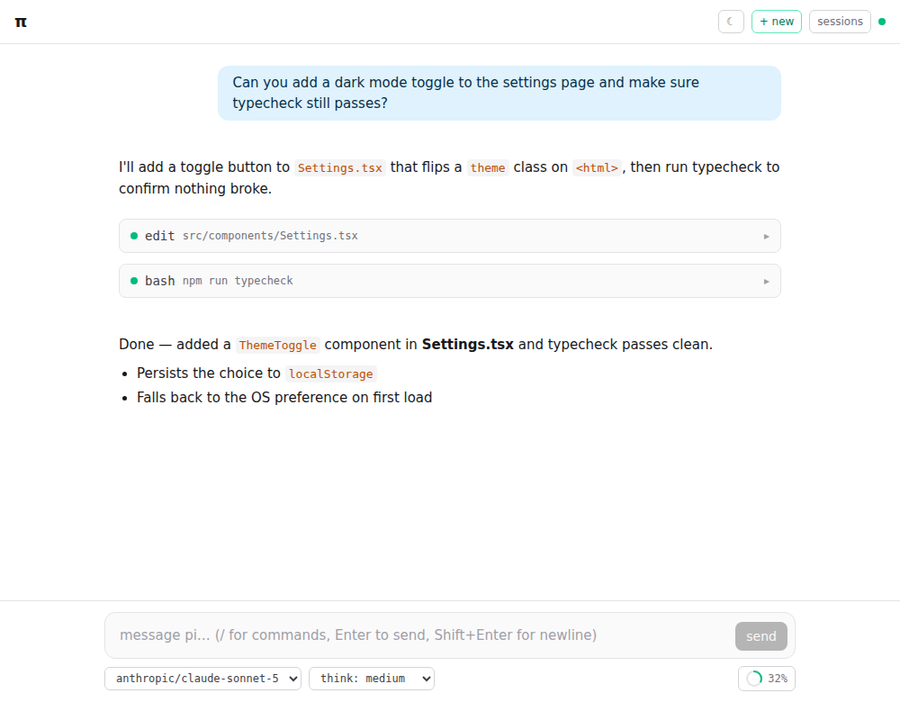
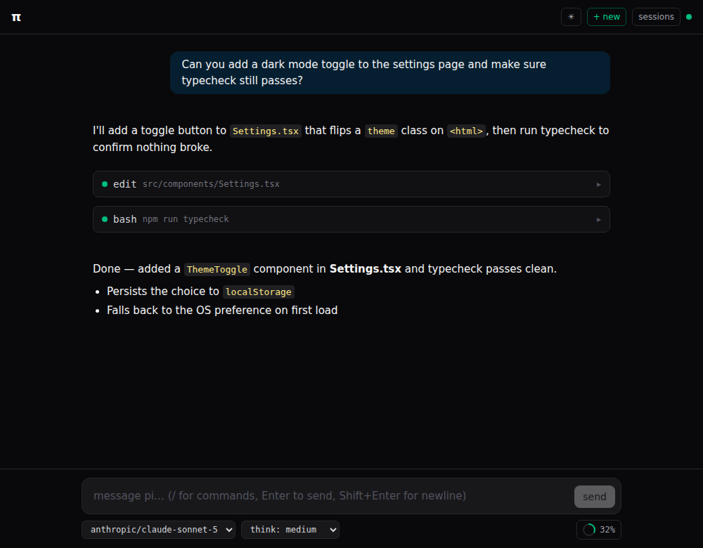

# Pi Interface

Web UI for the [pi coding agent](https://github.com/earendil-works/pi), built on its [SDK](https://github.com/earendil-works/pi/blob/main/packages/coding-agent/docs/sdk.md).

A Node server embeds a pi `AgentSession` and bridges it to a React chat UI over WebSocket: streaming responses, collapsible thinking blocks, live tool-execution cards (bash, edit, …), steering while the agent runs, and abort.

<p align="center">
  
  
</p>

## Requirements

- Node ≥ 20
- [pi](https://github.com/earendil-works/pi) configured (`~/.pi/agent/auth.json` or provider env vars like `ANTHROPIC_API_KEY`)

## Run

```bash
npm install
npm run dev
```

- Web UI: http://localhost:5173 (Vite dev server, proxies `/ws` to the agent server)
- Agent server: ws://127.0.0.1:3141/ws

The agent works in the directory the server is started from; override with `PI_CWD=/path/to/project`.

> **Security note:** the server binds to `127.0.0.1` and validates the WebSocket `Origin` header. The agent has bash/edit/write tools — never expose this server on a network without the sandbox config below.

## Features

- Streaming chat (markdown, thinking blocks, mermaid diagrams)
- Tool execution cards with live output
- Steer / follow-up while streaming, abort
- Model + thinking-level selectors
- Session list / resume / new / delete
- Slash commands with autocompletion (`/` in the composer: extension commands, prompt templates, skills)
- Extension "Custom UI" support: dialogs, notifications, status/widgets, editor prefill (see below)
- Standalone mode: own config dir, file sandbox, branding (see below)

## Standalone configuration

Optional. Create `pi-interface.config.json` next to where you launch the server (or point `PI_INTERFACE_CONFIG` at a file). See [`pi-interface.config.example.json`](pi-interface.config.example.json). Without it, the server behaves like a plain local pi (user's `~/.pi/agent`, full toolset).

| Key | Effect |
|-----|--------|
| `cwd` | Agent working directory |
| `agentDir` | Own config dir (auth, models, settings, sessions) — fully separate from `~/.pi/agent` |
| `sandbox.root` | File tools (read/ls/grep/find) are confined to this directory, symlinks resolved |
| `sandbox.allowWrite` | Adds edit/write, still confined to the root (default `false`) |
| `sandbox.allowBash` | Adds bash — **not path-confined**, explicit opt-in (default `false`) |
| `tools` | Tool allowlist in non-sandbox mode, e.g. `["read","grep","find","ls"]` |
| `noExtensions` / `extensionPaths` | Disable extension discovery / load only listed extensions |
| `server.allowedOrigins` | Extra exact Origins accepted on the WebSocket (embed the UI as a tab in another app) |
| `branding` | `title`, `welcome` message, `accentColor` — applied by the web UI |
| `branding.defaultTheme` | `"light"` \| `"dark"` \| `"system"` (default) — used when the client has no stored preference |
| `branding.allowThemeToggle` | Show the theme toggle button (default `true`). Set `false` when embedding in a host app that drives the theme itself — see below |

### Theming

The UI ships with light and dark themes. Precedence: a local pick from the toggle button (persisted in `localStorage`) or a message from a host page beats `branding.defaultTheme`, which falls back to the OS preference (`"system"`).

To embed pi-interface in another app that controls the theme, set `"allowThemeToggle": false` (hides the toggle) and drive the theme from the host page with:

```js
iframeWindow.postMessage({ type: "pi-interface:set-theme", theme: "light" }, "https://your-pi-interface-origin")
```

`theme` is `"light"`, `"dark"`, or `"system"`. This works whether or not the toggle is shown. Use the exact origin the UI is served from as the target, not `"*"`.

Relative paths are resolved against the config file's directory.

### Extension Custom UI

Extensions using pi's [Custom UI](https://github.com/earendil-works/pi/blob/main/packages/coding-agent/docs/extensions.md#custom-ui) (`ctx.ui.select/confirm/input/editor/notify/setStatus/setWidget/setTitle/setEditorText`) work in the web UI: dialogs render as a modal, `notify()` as a toast, `setStatus()` as a header badge, `setWidget()` above/below the composer. The bridge binds with `mode: "rpc"`, mirroring pi's own RPC-mode protocol — so `ctx.hasUI` is `true` and dialogs get real answers, but TUI-only features (`custom()`, custom footers/headers/editors, terminal input, themes) have no web equivalent and are no-ops, same as RPC mode.

Custom messages (`pi.sendMessage()` with a `customType`, see [Message and Entry Rendering](https://github.com/earendil-works/pi/blob/main/packages/coding-agent/docs/extensions.md#message-and-entry-rendering)) show up too, but without the extension's `MessageRenderer` — that returns a terminal `Component`, which has no browser equivalent. Instead it falls back to pi's own default look (violet card, markdown-rendered content), with any `details` payload collapsed behind a toggle (never verbose JSON by default). Messages sent with `display: false` stay hidden, same as in the TUI.

## Architecture

```
web/  (React + Vite + Tailwind)          server/  (Fastify + ws)
┌──────────────────────────┐             ┌─────────────────────────┐
│ useAgent (WS + reducer)  │  /ws JSON   │ AgentSession (pi SDK)   │
│ chat items: user /       │ ◄─────────► │ SDK events → lean wire  │
│ assistant / tool cards   │             │ events (shared/)        │
└──────────────────────────┘             └─────────────────────────┘
```

Sessions persist in `<agentDir>/sessions/` — reconnecting clients receive the full history (`hello` message).

Planned: fork/tree navigation, images, embeddable build.
