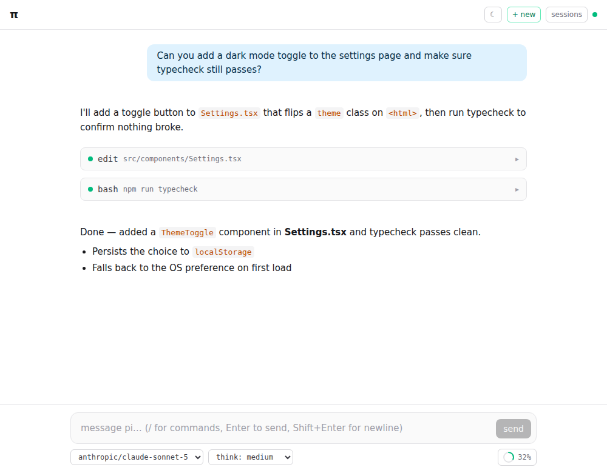
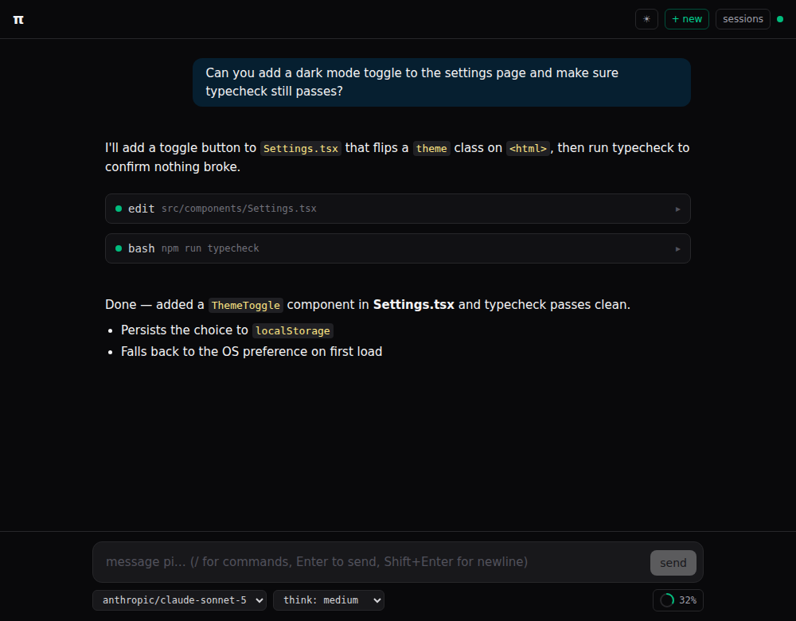

# Pi Outpost

[](https://github.com/laurentftech/pi-outpost/actions/workflows/ci.yml)
[](https://github.com/laurentftech/pi-outpost/actions/workflows/ci.yml)
[](LICENSE)
[](https://nodejs.org)

**A web interface for the [pi coding agent](https://github.com/earendil-works/pi)** — run it
as a standalone app on your own machine or server, install it as a desktop app, or embed it
as a Shadow-DOM-isolated widget inside another web application.

One Node process runs the agent and serves the interface: streaming answers, live tool
cards, a file browser and editor, git, PDF and Office documents, several projects open at
once — each with its own sandbox, history and agent — and a sandbox you decide the shape of.

<p align="center">
  
  
</p>

## Contents

- [Start in 5 minutes](#start-in-5-minutes)
- [How do I…](#how-do-i)
- [What you get](#what-you-get)
- [Model credentials](#model-credentials)
- [Projects](#projects)
- [Settings from the browser](#settings-from-the-browser)
- [Configuration file](#configuration-file)
- [Command line](#command-line)
- [Staying up to date](#staying-up-to-date)
- [Running it as a service](#running-it-as-a-service)
- [Installing it as an app](#installing-it-as-an-app)
- [Embedding](#embedding)
- [Work Plans](#work-plans)
- [Workspace Outcome](#workspace-outcome)
- [Development](#development)

## Start in 5 minutes

You need Node ≥ 24 (what the pi SDK itself requires) and an API key for one model
provider. You do *not* need [pi](https://github.com/earendil-works/pi) installed — its SDK
is bundled here.

**1. Go to the project you want to work on.** The configuration is written here, and the
agent starts out confined to this directory.

```bash
cd ~/projects/my-app
```

**2. Write a starter configuration.**

```bash
npx pi-outpost init
```

That gives you a read-only agent — it can read this directory, and nothing else: no
writing, no shell.

**3. Start it.**

```bash
npx pi-outpost
```

It serves on `http://127.0.0.1:3141/` and opens the interface in a window of its own — no
tabs, no address bar. `--open-in browser` puts it in a normal browser tab, `--no-open`
leaves it closed.

**4. Give it a model.** With no credentials, the interface asks for them instead of showing
a chat that could only fail: pick a provider and paste an API key, or declare an
OpenAI-compatible endpoint of your own — a corporate gateway, vLLM, Ollama, LM Studio.
Nothing to restart; the chat works as soon as you save.

**5. Ask it something.** "What does this project do?" is a good first turn — it can read
everything under this directory, and you will see it search and open files as it goes.

Then, when you want it to actually change things, open `pi-outpost.config.json` and widen
the sandbox — or do it from the gear menu, which applies immediately and writes the same
file:

```json
{
  "cwd": ".",
  "sandbox": { "root": ".", "allowWrite": true, "writableRoot": "./src", "allowBash": false }
}
```

**No Node, no npm?** Each release carries a single executable per platform under
[Releases](https://github.com/laurentftech/pi-outpost/releases), server and interface
inside. They are unsigned, so macOS and Windows warn on first launch; see
[docs/sea-packaging.md](docs/sea-packaging.md), which also covers building one yourself with
`npx pi-outpost build-exe`.

### Why it insists on a configuration file

pi-outpost never starts without one: the agent's working directory, its tools and its
sandbox are decided there, and guessing them from whatever directory you happen to be
standing in is not a decision anyone wants made for them. `init` writes the safe version of
that file — read-only, no bash — for you to open up as needed:

```json
{
  "cwd": ".",
  "agentRuntime": { "mode": "embedded" },
  "sandbox": { "root": ".", "allowWrite": false, "allowBash": false },
  "server": { "port": 3141, "host": "127.0.0.1" },
  "branding": { "title": "π" }
}
```

Not sure which file is in force, or why a setting has the value it has? **`pi-outpost
config`** prints the resolved configuration and the file it came from, without starting
anything.

> **Security note.** The server binds to `127.0.0.1` and validates the WebSocket `Origin`
> header. The agent can be given bash, edit and write tools — never expose this server on a
> network without a sandbox **and** an auth token: set `server.token` (or the
> `PI_OUTPOST_TOKEN` environment variable, which wins) to a long random secret, e.g.
> `openssl rand -hex 32`. Binding off loopback without one is **refused**, not merely
> discouraged. Clients authenticate by opening `http://host:3141/?token=<secret>` once
> (stored locally, stripped from the URL) or via the embed widget's `token` option. Use a
> reverse proxy or Tailscale for transport encryption.

## How do I…

Task-by-task recipes live in [`docs/how-to.md`](docs/how-to.md) — the configuration each
one needs, the command that proves it works, and the caution that goes with it.

| | |
|---|---|
| [Let the agent write in one folder only](docs/how-to.md#let-the-agent-write-in-one-folder-only) | [Give the agent a shell](docs/how-to.md#give-the-agent-a-shell) |
| [Work on several projects at once](docs/how-to.md#work-on-several-projects-at-once) | [Use a local or self-hosted model](docs/how-to.md#use-a-local-or-self-hosted-model) |
| [Reach it from your phone](docs/how-to.md#reach-it-from-your-phone-or-another-machine) | [Run it on a Linux server](docs/how-to.md#run-it-permanently-on-a-linux-server) |
| [Keep several setups side by side](docs/how-to.md#keep-several-setups-side-by-side) | [Hand it to someone who has no Node](docs/how-to.md#hand-it-to-someone-who-has-no-node) |
| [Teach the agent something](docs/how-to.md#teach-the-agent-something) | [Restrict which models can be picked](docs/how-to.md#restrict-which-models-can-be-picked) |
| [Read a big PDF, Word or Excel file](docs/how-to.md#let-the-agent-read-a-big-pdf-word-or-excel-file) | [Lock down a shared deployment](docs/how-to.md#lock-down-a-shared-deployment) |
| [Put it inside your own web app](docs/how-to.md#put-it-inside-your-own-web-app) | [Use an existing pi installation](docs/how-to.md#use-an-existing-pi-installation) |
| [When something does not work](docs/how-to.md#when-something-does-not-work) | |

## What you get

### The conversation

- Streaming answers in markdown, with collapsible thinking blocks, mermaid diagrams, math,
  inline images and clickable workspace file links
- Tool cards with live output and, for tools that report it, a progress bar. One toggle
  hides them all when they drown the conversation, and the preference sticks
- Results rendered by what they are, not by which tool produced them: a `git diff` becomes
  per-file diffs with `open` and `history` beside each path, a search becomes hits grouped
  by file, an edit becomes the diff it applied — the raw output always one keystroke away
- Steer or follow up while the agent is streaming, and abort
- Model and thinking-level selectors; tokens and price per turn, plus a session-analysis
  panel — cost across turns, tool calls ranked by output size or failure, every row jumping
  back to the message that produced it
- Sessions: list, resume, rename, delete, and full-text search across saved transcripts
- Conversation tree: edit a past message to re-ask it; the old exchange stays reachable as a
  branch you can navigate back to
- Slash commands (`/`) and file mentions (`@`) with autocompletion, and a button back to the
  latest message when you have scrolled up
- Attachments: drop or paste images and text files into the composer. A PDF, `.docx`,
  `.xlsx` or `.pptx` is uploaded into the workspace and attached as a **path**, so the agent
  reads it with its extraction tools instead of the prompt carrying its content

### The workspace

- [Several projects open at once](#projects), each with its own agent, sandbox, sessions and
  history — switch between them while work continues in the ones you are not watching, and
  get a browser notification when a background project needs an answer or is ready for review
- File browser: lazy-loaded tree, syntax-highlighted viewer, Markdown rendering, and an
  editor that saves inside the writable zone. Create, rename, move, copy, delete, or open a
  file with the system's own application; anything outside the writable zone is dimmed
- Split view: a Markdown or structured document renders beside the editor, following what
  you type rather than what was last saved
- Git: uncommitted-change badges in the tree, per-file diffs, log and commit inspection, and
  a per-file history graph (renames followed) that diffs any two revisions, working tree
  included. A directory of independently versioned projects works too — each child
  repository answers for its own files. See [Git](#git)
- PDF in the viewer (pages, zoom, keyboard paging); the agent reads its text and tables
  through `pdf_extract` — no shell, no external binary, no OCR
- Office documents: `docx_extract`, `xlsx_extract` and `pptx_extract` give the agent Word
  text and tables, one markdown table per spreadsheet sheet, and slide structure with
  speaker notes. Each takes an `output_path`, to write the whole document to a file instead
  of spending the context on it twice
- Structured results: a tool can hand back **data** — a graph, a sequence, a table — and the
  interface draws it, with an approval gate when the document names a `target`. Files that
  declare the schema open as the diagram they describe, and any diagram exports as a
  self-contained SVG. See [`docs/structured-exchange.md`](docs/structured-exchange.md)
- [Work Plans](#work-plans): for non-trivial work the agent keeps an explicit hierarchy of
  objectives, dependencies and verification state beside the conversation
- [Workspace Outcome](#workspace-outcome): review plan progress, recorded verification, and
  changed files from one deterministic workspace view

### Setting it up and shipping it

- First run in the browser asks for credentials instead of failing cryptically: paste an API
  key, or declare your own OpenAI-compatible endpoint
- [Settings from the browser](#settings-from-the-browser): sandbox permissions and roots,
  skill and extension directories — persisted to your configuration file, no restart
- A sandbox that decides what the agent can read, write and run, per project
- [Installable as an app](#installing-it-as-an-app), and downloadable as a single executable
  with no Node.js needed
- [Embeddable widget](#embedding) (`@pi-outpost/embed`) with its own workspace policy
- Extension "Custom UI" support: dialogs, notifications, status badges, widgets, editor
  prefill
- Two agent runtimes behind the same interface: the bundled pi SDK, or a supervised
  `pi --mode rpc` child process

## Model credentials

For built-in providers, credentials come from either **provider environment variables**
(`ANTHROPIC_API_KEY`, …) or an **`auth.json` in the agent directory** —
`<agentDir>/auth.json`, which is `~/.pi/agent/auth.json` unless your configuration names its
own `agentDir`. A custom OpenAI-compatible provider, including its key, is stored separately
in `<agentDir>/models.json`.

| | |
|---|---|
| **The interface** | With no usable model, pi-outpost shows a setup screen instead of a chat that could only fail. Pasting a key for a built-in provider writes `<agentDir>/auth.json`; declaring your own endpoint writes the provider and its key to `<agentDir>/models.json`. Either takes effect immediately — no restart |
| **`pi-outpost login`** | For headless servers, where no browser will ever open the interface:<br>`pi-outpost login --provider anthropic` (prompts, not echoed)<br>`echo "$KEY" \| pi-outpost login --provider anthropic` (scripted)<br>The key has no flag on purpose — argv is readable by anyone who can list processes |
| **Environment** | `export ANTHROPIC_API_KEY=…` before starting. Nothing is written to disk |

### An OpenAI-compatible endpoint of your own

A corporate gateway, vLLM, SGLang, Ollama, LM Studio — anything speaking the OpenAI API.
Declare it from the setup screen (name, base URL, key, model id) and it is written to
`<agentDir>/models.json` in pi's own format, so it survives restarts and any pi process
sharing that directory sees it.

The two **compatibility** checkboxes on that form are not a detail to skip. Many
OpenAI-compatible servers reject the `developer` role and the `reasoning_effort` field that
pi sends to reasoning-capable models — and when they do, *every* turn fails, with an error
that never names the cause. Unchecking them makes pi send a plain `system` message and drop
`reasoning_effort`.

### Behind a TLS-inspecting proxy

A corporate proxy that re-signs certificates with an internal CA makes Node reject the
chain, which surfaces as a bare `fetch failed`. Trust the CA and everything verifies:

```bash
export NODE_EXTRA_CA_CERTS=/path/to/corp-ca.pem
```

pi-outpost detects that failure and names this variable rather than leaving you to guess.
There is deliberately **no configuration key that disables TLS verification**: it would
disable it for every outbound connection — including the one carrying your API key — and a
flag in a file gets copied between machines and outlives the reason it was added.

## Projects

One server can hold several projects at once. Each has its own agent session, its own
sandbox, its own file tree and its own session history; the agent keeps working in the
projects you are not looking at.

- **Open one** from the project control in the header: browse the server's filesystem and
  pick a directory. It is usable straight away, and it is still there after a restart
- **Switch** without a reload. A turn running in the project you leave runs to completion,
  and its result is waiting when you come back. Unsent composer text is kept per project
- **See what is happening elsewhere**: every project reports whether it is stopped, starting,
  idle, working, waiting for you, or ready for review. Waiting means the agent needs an answer;
  ready for review means its authoritative Work Plan has no unfinished task and at least one
  task awaiting review. Both raise the selector's attention badge. When the window is in the
  background, a browser notification names the project and the kind of attention without
  exposing its plan or workspace content. Nothing ever interrupts the project you are looking
  at, and merely selecting it does not acknowledge either state
- **Close one** to release its resources; the sessions on disk stay, so reopening the same
  directory finds them again. Closing is refused while its agent is running a turn, and the
  last remaining project cannot be closed
- Projects that nobody is using are retired after `workspaceIdleTimeoutMs` (30 minutes by
  default, `0` disables it) and rebuilt transparently on next use. A project running a turn,
  waiting for you, or ready for review is never retired

A configuration where no project has ever been opened behaves exactly as a single-project
server: `cwd` alone. `"workspaceLock": true` pins the server to one project and removes the
open/switch/close controls entirely.

## Settings from the browser

The gear menu changes what the agent may do, without editing a file or restarting the
server. Accepted changes are written to the configuration file that is loaded and applied to
a fresh agent session immediately.

| What | Notes |
|---|---|
| Sandbox root and writable root | Browse the server's directories and pick one — no need to know the host's paths by heart |
| Write and bash permissions | The same switches as `sandbox.allowWrite` / `sandbox.allowBash` |
| Skill directories | Added under `userSkillPaths` |
| Extension directories | Added under `userExtensionPaths`; a directory is enough, its extensions are discovered |

Two lists, deliberately: what the **configuration file** declares (`skillPaths`,
`extensionPaths`) belongs to the deployment, and the interface can neither rewrite nor
remove it. What is added from Settings lives under its own key, and is the only thing the
interface offers to remove.

A deployment can forbid any of it: `sandboxLocks` locks individual sandbox fields,
`extensionLock` forbids extension-path changes (skill paths stay editable — loading code is
not the same act as pointing the agent at more text to read). What is locked is refused by
the server, not merely hidden by the interface.

If the file cannot be written, nothing is applied and the session in front of you is left
exactly as it was.

## Configuration file

The server reads the **first** of these that exists, and only that one — configurations are
never merged, so the file you are reading is the configuration that is running:

1. `--config <path>`
2. `--profile <name>` → `<user config dir>/profiles/<name>.json`
3. `$PI_OUTPOST_CONFIG`
4. `$PI_OUTPOST_PROFILE` → `<user config dir>/profiles/<name>.json`
5. `./pi-outpost.config.json` (the directory you launch from)
6. `<user config dir>/config.json`

`<user config dir>` is `$XDG_CONFIG_HOME/pi-outpost`, or `~/.config/pi-outpost`. A file you
name explicitly must exist; the two implicit locations are simply skipped. Found nothing? The
server refuses to start and tells you to run `pi-outpost init`.

**Profiles.** `--profile work` (or `$PI_OUTPOST_PROFILE`) reads
`<user config dir>/profiles/work.json`. A profile is an ordinary configuration file — same
keys, same rules — so `pi-outpost --profile work` from anywhere gives you the setup you
configured once.

**Precedence.** For any setting that appears in more than one place: **flag > environment
variable > file > default** — except the fields you can change from Settings, where what you
applied wins and persists. Environment variables: `PI_OUTPOST_PORT` (falling back to `PORT`,
which platforms inject), `PI_OUTPOST_HOST`, `PI_OUTPOST_CWD`, `PI_OUTPOST_AGENT_DIR`,
`PI_OUTPOST_TOKEN`, `PI_OFFLINE`.

One exception, and it is deliberate: **a sandbox that grants write or bash but names no
`sandbox.root` refuses a `--cwd`/`PI_OUTPOST_CWD` override.** Such a sandbox falls back to
`cwd`, so an inherited variable (a shell profile, a CI job, a compose file) could otherwise
turn "write inside my project" into "write inside `/`" without touching the file that
granted it. Name the root, and the grant says what it covers.

Relative paths are resolved against the configuration file's directory. A larger example lives
in [`pi-outpost.config.example.json`](pi-outpost.config.example.json).

### Workspace and sandbox

| Key | Effect |
|-----|--------|
| `cwd` | Agent working directory, and the default project |
| `agentDir` | Own config dir (auth, models, settings, sessions) — fully separate from `~/.pi/agent`. It starts with **no credentials**: see [Model credentials](#model-credentials) |
| `sandbox.root` | Read-only zone: read/ls/grep/find are confined to this directory, symlinks resolved. Defaults to `cwd` |
| `sandbox.allowWrite` | Adds edit/write, confined to `sandbox.writableRoot` (default `false`) |
| `sandbox.writableRoot` | Read-write zone: a subdirectory of `root` that edit/write are further confined to. Defaults to `root` itself |
| `sandbox.allowBash` | Adds bash — **not path-confined**, explicit opt-in (default `false`) |
| `sandboxLocks` | Which sandbox fields Settings may **not** change: `root`, `writableRoot`, `allowWrite`, `allowBash` |
| `workspaceLock` | Pin the server to one project: opening, closing and switching are refused, and no control is offered |
| `workspaceIdleTimeoutMs` | How long an unused project stays alive before it is retired (default `1800000` — 30 min; `0` never retires). A project running a turn, waiting for you, or ready for review is never retired |
| `openProjects` | The set of open projects. **Written by the server** when you open or close one — not hand-authored |
| `files.watch` | Watch the directories the file browser has listed, so the tree follows the workspace whoever changed it (default `true`). Set `false` where a watch is a liability — a network mount that emits no events, a spent inotify budget. The tree's ↻ control re-lists by hand either way |

### Agent resources

| Key | Effect |
|-----|--------|
| `agentRuntime` | `{ "mode": "embedded" }` (default) keeps the pi SDK session in this process; `{ "mode": "rpc", "executable": "pi", "args": [] }` supervises a `pi --mode rpc` child. See [Agent runtimes](#agent-runtimes) |
| `agentRuntime.startupTimeoutMs` / `commandTimeoutMs` / `shutdownGraceMs` | RPC child startup, per-command and graceful-shutdown ceilings. Defaults: `60000`, `300000` and `5000` ms |
| `tools` | Tool allowlist when no sandbox is configured, e.g. `["read","grep","find","ls"]` |
| `noExtensions` / `extensionPaths` / `extensionScripts` | Disable extension discovery, or name extension files and directories the deployment loads |
| `userExtensionPaths` | Extension directories added from Settings. Written by the server; `extensionPaths` stays yours |
| `extensionLock` | Forbid adding or removing extension paths from Settings |
| `noSkills` / `skillPaths` | Disable skill discovery, or name skill files and directories. `skillPaths` loads even under `noSkills`. Disabling matters for real isolation: skills otherwise also load from `~/.agents/skills` and from `.agents/skills` walked up from `cwd`, neither of which `agentDir` scopes |
| `userSkillPaths` | Skill directories added from Settings, loaded after `skillPaths` |
| `noPromptTemplates` / `promptPaths` | Same for prompt templates (`agentDir` and the project's `cwd/.pi/prompts`) |
| `allowedModels` | Restrict the model switcher to these `{ "provider", "id" }` pairs. Without it, every built-in model whose provider has auth is listed — often more variants than a deployment actually serves |
| `thinkingLevels` | Declare what thinking levels a model accepts, for one the runtime cannot describe. See [Thinking levels](#thinking-levels) |
| `systemPrompt` / `systemPromptFile` | Replace pi's built-in system prompt entirely (mutually exclusive). Project context files, skills and `appendSystemPrompt` still layer on top |
| `appendSystemPrompt` | Extra paragraphs appended after the system prompt |
| `webContext` | Tell the agent its replies render in this interface — markdown, inline images, file links (default `true`) |
| `offline` | Never fetch remote model catalogs. On a host that cannot reach them, that request hangs and stalls every credential change by 20 s. Built-in and `models.json` providers are unaffected. `--offline` and `PI_OFFLINE` also turn it on |

### Documents

| Key | Effect |
|-----|--------|
| `pdf.maxBytes` | Largest PDF the viewer may load and `pdf_extract` may read (default `26214400` — 25 MB). Every other file keeps the 1 MB limit |
| `docx.maxBytes` / `xlsx.maxBytes` / `pptx.maxBytes` | The same ceiling, per format, for the Office extractors |
| `structuredExchange.maxBytes` | Largest structured-exchange document the viewer may open (default `4000000`, the contract's own ceiling for schema version 1). Recognition is by the document's declared `schema`, never by its extension, so other JSON keeps the 1 MB preview limit. A larger value is clamped to the contract's |

### Server and interface

| Key | Effect |
|-----|--------|
| `server.port` | Port to listen on (default `3141`). `--port` and `PI_OUTPOST_PORT`/`PORT` override it |
| `server.host` | Address to bind (default `127.0.0.1` — only change this if you have read the security note above) |
| `server.allowedOrigins` | Extra exact Origins accepted on the WebSocket, and given CORS headers on the HTTP endpoints |
| `server.token` | Shared secret required on the WebSocket, `/branding` and `/files/raw` (`PI_OUTPOST_TOKEN` overrides). Mandatory in practice off loopback |
| `openBrowser` | Whether starting the server opens the interface (default: wherever a desktop session exists) |
| `openIn` | `"window"` (its own window, the default) or `"browser"` (a tab). `openBrowser` still decides *whether* |
| `branding` | `title` (default `"π"`), `welcome` message, `accentColor` |
| `branding.defaultTheme` | `"light"` \| `"dark"` \| `"system"` (default), used when the client has no stored preference |
| `branding.allowThemeToggle` | Show the theme toggle (default `true`). Set `false` when a host app drives the theme |
| `terminal.enabled` | Enable integrated interactive web terminal (default `false` — explicit opt-in only). See [Integrated Terminal](#integrated-terminal) |
| `terminal.shell` | Path to the shell executable (default: Git Bash -> PowerShell on Windows; `$SHELL` -> `/bin/zsh` -> `/bin/bash` on Unix) |
| `terminal.shellArgs` | Arguments passed to the shell (default: `["-l"]` on Unix login shells) |
| `embed.workspaceControls` | What a mounted widget offers: `"settings"` (default, one project), `"root"` (a compact root chooser), `"projects"` (open/switch/close) |
| `updateCheck` / `updateRegistry` | See [Staying up to date](#staying-up-to-date) |
| `gitPath` | Path to the git executable. Unset, git is found on `PATH` and then where installers put it. See [Git](#git) |

### Git

Git features need a git to run. It is looked for in this order:

1. `gitPath`, when the configuration names one
2. `git`, as `PATH` resolves it
3. The standard install locations — `C:\Program Files\Git\cmd\git.exe` and friends on
   Windows, `/usr/bin/git` and the Homebrew and Xcode paths on macOS, `/usr/bin/git` and
   `/usr/local/bin/git` on Linux

The third step exists because git is routinely installed and absent from the `PATH` a
server process inherits — a Windows machine where VS Code shows git perfectly while a
service launched from a shortcut cannot find it at all.

A `gitPath` that is not a runnable git fails startup, naming it. It never falls back to
another git: naming an executable is an instruction, and quietly running a different one
would answer questions about the wrong installation.

When git features are missing, **Settings says why**: the executable could not be run, this
project is not in a repository, or git refused it — with git's own message, which for the
common "detected dubious ownership" names both the directory and the remedy.

### Thinking levels

The thinking-level control offers only the levels the current model accepts — which the
runtime normally reports. For a model declared against your own endpoint it cannot: the
SDK does not recognise the name, the control falls back to offering everything, and a
model that cannot think at all gets a slider that goes to `xhigh` and snaps back.

Declare the answer instead:

```json
"thinkingLevels": [
  { "provider": "maison", "levels": ["off"] },
  { "provider": "maison", "id": "big", "levels": ["off", "low", "medium"] }
]
```

An entry without `id` covers every model of that provider; where both could apply, the one
naming the model wins. Levels are normalised as a runtime-reported list is — unknown names
dropped, canonical order, `off` always available — and an entry naming no usable level
fails startup rather than leaving a model nothing can be asked of.

A declaration is **authoritative**: it replaces what the runtime reports, because the
setting exists precisely for the models the runtime is guessing about. A `set_thinking`
naming a level outside a declared set is refused rather than forwarded, whichever client
sends it.

Changing the model **settles** the level on the new model's scale: a session on `high`
moving to a model that stops at `low` lands on `low`, and one moving to a model that
accepts no thinking lands on `off` — never a step up, which would spend more effort than
was asked for. The interface is told what it settled at, so it cannot go on showing a
level the agent is not using. A model with a single accepted level says so in the control
rather than offering a slider with nowhere to go.

### Theming

Light and dark themes ship with the interface. Precedence: a local pick from the toggle
(persisted in `localStorage`) or an explicit override (the embed widget's `theme` option or
`setTheme()`, or a host page's `postMessage`) beats `branding.defaultTheme`, which falls
back to the OS preference.

### Agent runtimes

`agentRuntime.mode` decides what actually runs the agent. `embedded` (the default) keeps a
pi SDK session inside this process. `rpc` supervises a `pi --mode rpc` child — to match an
existing pi installation, or to isolate a crash.

pi-outpost appends `--mode rpc` and derives `--session-dir` itself, so `args` may contain
neither, nor `--tools`/`--system-prompt` (those come from `tools`/`systemPrompt`), nor any
flag that would make the child print something and exit. The rest of the configuration
travels to the child, and pi-outpost's own tools go with it, so the same file describes the
same agent either way.

Two things to know before switching: **`sandbox` cannot be combined with `rpc`** and the
pair is refused at load — the sandbox is a replacement toolset this server builds, and a
child builds its own; isolate it with a container or a dedicated user instead. And a few
features have no RPC equivalent and say so rather than failing quietly: storing credentials,
declaring a provider, changing the sandbox from Settings, tree navigation, and editing a
past message. Sessions are not auto-titled there either.

## Command line

```
pi-outpost [options]          start the server
pi-outpost init [options]     write a starter configuration file
pi-outpost config [options]   print the configuration that would be used, and where it came from
pi-outpost doctor [options]   check whether this installation can start and serve, and say what stops it
pi-outpost login --provider <name>
                              store an API key in <agentDir>/auth.json
pi-outpost build-exe [options]
                              build a standalone executable from this installation
pi-outpost update [--check]   move to the newest published version, or just look
```

| Flag | Effect |
|------|--------|
| `--config <path>` | Configuration file to use |
| `--profile <name>` | Use `<user config dir>/profiles/<name>.json` |
| `--cwd <dir>` | Directory the agent works in |
| `--agent-dir <dir>` | pi config/session store (default `~/.pi/agent`) |
| `--port <n>` / `--host <addr>` | Where to listen (default `127.0.0.1:3141`) |
| `--offline` | Never fetch remote model catalogs |
| `--open` / `--no-open` | Open the interface once listening (default: wherever a desktop session exists) |
| `--open-in <shape>` | `window` (its own window, the default) or `browser` (a tab) |
| `--terminal` / `--no-terminal` | Enable or disable the integrated web terminal (default `false`) |
| `-h, --help` / `-v, --version` | |
| `login --provider <name>` | Store a key for that provider (prompted, or read from stdin — never a flag) |
| `init --global` | Write to the user config directory instead of `./` |
| `init --force` | Overwrite an existing file |
| `build-exe --out <path>` | Where to write the executable (default `./pi-outpost`, `.exe` on Windows) |
| `build-exe --force` | Replace an existing file at that path |
| `update --check` | Report what is available and install nothing |

There is deliberately **no `--token` flag**: a secret on the command line is readable by
anyone who can list processes. Use `PI_OUTPOST_TOKEN` or the file's `server.token`.

### `pi-outpost doctor`

When the page will not load and it is not obvious why, run `doctor` in the directory
you start the server from. It reports, in one pass and without stopping at the first
problem:

- **installation** — the version, and whether this is a global install, a checkout, an
  `npx` run or a standalone executable
- **configuration** — which file a start would read, or, when there is none, both paths
  it looked in and the `init` that writes one
- **settings** — the address to open, the agent's working directory, the runtime,
  whether a token is set (never its value) and whether the terminal is on
- **address** — whether the port is free, already serving another Pi Outpost, or taken
  by something else
- **web UI** — whether this installation actually has an interface to serve
- **git**, and **node-pty** when the terminal is enabled

It exits non-zero when something would stop the server from serving, so it can gate a
script. Unlike `config`, it never needs a configuration file to run — that absence is
one of the things it is there to report.

**The most common cause of "the page does not connect", in a directory you have not
used before**: there is no configuration file, so the server prints the paths it
searched and exits before it ever binds the port. Installing Pi Outpost globally does
not create one — the install and the configuration are separate acts:

```
pi-outpost init            # a configuration for this directory
pi-outpost init --global   # one that every directory falls back to
```

The global file lives in `<user config dir>/config.json` — `$XDG_CONFIG_HOME/pi-outpost`
or `~/.config/pi-outpost`, which on Windows means `C:\Users\<you>\.config\pi-outpost`
and **not** `%APPDATA%`. `doctor` prints the resolved path, so there is nothing to guess.

## Integrated Terminal

When enabled via `--terminal`, `PI_OUTPOST_TERMINAL=1`, or `"terminal": { "enabled": true }` in the configuration file, Pi Outpost provides an interactive pseudo-terminal (PTY) directly in the browser:

- **Full PTY multiplexing**: Real interactive login shells (`bash`, `zsh`, `powershell`) with 24-bit ANSI color and xterm.js emulation over the existing authenticated WebSocket connection.
- **Multi-Tab with inline renaming**: Create tabs (`+`), close them (`✕`), and double-click on any tab title to rename it.
- **Background minimization**: Press `Ctrl+\`` (or `Cmd+\``) or click `>_ terminal` in the header to minimize the panel without interrupting active builds, commands, or logs.
- **1-Click Workspace Repointing**: The terminal detects current working directory (`pwd`) in real time (supporting OSC 7). Clicking `📁 <dir> → open as project` repositions the AI agent, file browser, and git view to that subdirectory.


When the server cannot start — a port already taken, an unreadable directory, a bad
configuration — it says which of those it was in a sentence, not a stack trace. A window
launched from a file manager, which would otherwise close with the process and take the
message with it, waits for a keypress first.

## Staying up to date

The server checks once a day whether a newer version has been published, and says so in one
line if there is. **It never installs anything on its own** — `pi-outpost update` is the
only thing that installs, and only when you run it without `--check`.

What `update` does depends on how this copy was installed, which it works out rather than
asking:

| How you run it | What `update` does |
|------|------|
| Global npm install | Prints `npm install -g pi-outpost@latest`, runs it, reports the version it moved to |
| Source checkout | Refuses, and tells you to `git pull` — installing would put a *second* copy elsewhere and leave the one you are running untouched |
| `npx pi-outpost` | Explains that your next `npx` already fetches the newest version |
| Standalone executable | Refuses to overwrite itself, and points at the [releases](https://github.com/laurentftech/pi-outpost/releases) |

A check that fails is never reported as "up to date": `update --check` says it could not
check, and why, and exits non-zero.

| Key | Effect |
|------|------|
| `updateCheck` | `false` disables checking entirely. `true` enables it **even under `offline`**. Unset, `offline` decides |
| `updateRegistry` | Optional registry override, when npm's own configuration does not name the right one |

Version checks normally run through `npm view`, so an existing `.npmrc` remains the source
of truth for an internal registry, authentication, CA certificates and proxies. No duplicate
pi-outpost setting is required for a Nexus setup that already works with npm.

`offline` means "remote model catalogs are unreachable", which is not the same network as a
package registry — a host air-gapped from the former can still reach an internal npm proxy,
and that is exactly the deployment where knowing a release exists matters. So `offline` is a
default for update checking, not a veto.

## Running it as a service

```bash
npm run start
```

Builds the interface once and starts **one** Node process serving the app, `/ws`,
`/branding` and `/health` together on `server.port` — nothing else to run or keep track of.
Point a process manager (systemd, pm2, Docker `CMD`, …) at that one command.

It reads *your* configuration (`./pi-outpost.config.json`, or any of the locations above);
with none, it refuses to start and says so. There is no hot reload here: rebuild
(`npm run build --workspace web`) and restart after a UI change.

To distribute a version that needs no Node.js at all — a Windows `.exe` for non-technical
users, say — see [`docs/sea-packaging.md`](docs/sea-packaging.md).

## Installing it as an app

The standalone interface declares itself to the browser, so it can be installed from the
address bar and opened from the desktop or taskbar: its own window, its own name and icon,
no tabs.

It is the same interface, on the same server, with the same sessions — installation changes
where it runs, never what it is. It also caches nothing of itself: with the server down, an
installed app says it cannot reach it rather than showing a stale copy of a previous build.

A mounted widget claims nothing on its host page: no manifest, no icon, no change to whether
the host page itself is installable.

## Embedding

`embed/` publishes `@pi-outpost/embed`, mounting pi-outpost into any element inside a
**Shadow DOM** — fully isolated from the host app's CSS in both directions, React supplied as
a peer dependency, everything else compiled into the package.

```js
import { mount } from "@pi-outpost/embed";

const widget = mount(document.getElementById("assistant"), {
  serverUrl: "https://your-pi-outpost-server", // omit for same-origin
  theme: "dark",          // optional; falls back to branding.defaultTheme, then "system"
  token: "…",             // optional; a host that already authenticates its user sees no token screen
  workspace: "/srv/projects/acme", // optional; which project this widget shows
});

widget.setTheme("light"); // change the theme at runtime
widget.unmount();         // tear down the React tree
```

Which project a widget shows is the **host's** decision: `workspace` names it by its
resolved root, and a root that is not open falls back to the default rather than failing.
What the widget offers *around* it is the server's decision, via
`embed.workspaceControls`: `settings` (the default — one project, sandbox root editable
through Settings only), `root` (a compact root chooser in the header) or `projects` (the
open/switch/close controls the standalone app has). A `workspaceLock` on the server
suppresses project controls whatever the policy says.

Two things to configure server-side, whatever the topology:

- **`server.allowedOrigins`**: the widget's WebSocket carries the *host page's* origin, not
  pi-outpost's — add it explicitly. Even same-domain deployments need this; only
  `localhost`/`127.0.0.1` are trusted automatically
- **CORS**: an origin listed there also receives CORS headers on the HTTP endpoints
  (`/branding`, `/health`, `/files/raw`, the static app), so a genuinely cross-origin widget
  works without a proxy in front. The allowlist is the whole of it

A raw iframe (`<iframe src="https://your-pi-outpost-server">`) still works too, and honours
`branding.allowThemeToggle: false` plus the host-driven theme channel:

```js
iframeWindow.postMessage({ type: "pi-outpost:set-theme", theme: "light" }, "https://your-pi-outpost-origin")
```

### Extension Custom UI

Extensions using pi's [Custom
UI](https://github.com/earendil-works/pi/blob/main/packages/coding-agent/docs/extensions.md#custom-ui)
(`ctx.ui.select/confirm/input/editor/notify/setStatus/setWidget/setTitle/setEditorText`) work
in the web interface: dialogs render as a modal, `notify()` as a toast, `setStatus()` as a
header badge, `setWidget()` above or below the composer. The bridge binds with `mode: "rpc"`,
mirroring pi's own RPC-mode protocol — so `ctx.hasUI` is `true` and dialogs get real answers,
while TUI-only features (`custom()`, custom footers/headers/editors, terminal input, themes)
are no-ops, same as in RPC mode.

Custom messages (`pi.sendMessage()` with a `customType`) show up too, without the extension's
terminal `MessageRenderer`: they fall back to pi's own default look, with any `details`
payload collapsed behind a toggle. Messages sent with `display: false` stay hidden, as in the
TUI.

### Reporting progress from a tool

A long-running tool can report how far along it is. From `execute`, call `onUpdate` with a
`progress` fraction between `0` and `1` in `details` — the same call you already make to
stream partial output:

```ts
async execute(toolCallId, params, signal, onUpdate) {
  for (let i = 1; i <= steps; i++) {
    await doOneStep();
    onUpdate?.({ content: [{ type: "text", text: `step ${i}/${steps}` }], isPartial: true, details: { progress: i / steps } });
  }
  return { content: [{ type: "text", text: "done" }] };
}
```

The interface then shows a determinate bar on the tool card while the call runs. It is a
hint: a value outside `0..1` is clamped, the bar appears once the first fraction arrives and
disappears when the tool finishes, and a tool that reports nothing looks exactly as it did.

## Work Plans

The Work Plan belongs to the agent. For non-trivial work it is its explicit working state: a
persistent hierarchy used to decompose objectives, track execution and dependencies, record
resources and blockers, and reconcile verification before declaring the work complete. It is
not a second activity log, and trivial exchanges need no plan.

Tasks use five states: `todo`, `in_progress`, `blocked`, `needs_review` and `done`. A blocked
or review state can carry a reason, and tasks can link to resources; workspace resources open
directly in the file viewer. The panel is read-only for now, so the conversation stays your
control surface while the agent owns the plan through its `work_plan` tool.

When a non-empty plan contains at least one `needs_review` task and every other task is either
`needs_review` or `done`, the project becomes **ready for review** in the project selector.
This is derived from the persisted plan, not from a turn or tool merely ending. Opening or
switching to the project does not clear it: tell the agent what you accept or what must change.
Accepted review tasks move to `done`; meaningful resumed work moves the relevant task back to
an active state, so the project stops being ready until it reaches the review boundary again.

Tasks can also carry agent-owned verification or supporting evidence. Each generic record has
an `id`, a free-form `type`, a `result` (`passed`, `failed`, `inconclusive` or
`informational`), and at least a concise `summary` or a resource `reference`. The agent replaces
one task's complete evidence collection with `set_evidence`, preserving older failures when it
wants to append another result:

```json
{"action":"set_evidence","taskId":"build","evidence":[{"id":"tests","type":"test","result":"passed","summary":"Focused tests passed"},{"id":"probe","type":"external-check","result":"failed","summary":"External probe failed"}]}
```

Evidence and status are deliberately independent: evidence never completes or blocks a task,
and marking a task `done` never fabricates evidence. Pi Outpost does not automatically turn tool
activity or conversation claims into evidence; agents record evidence explicitly through the
structured tool.

Each plan is stored beside its session file. It is restored on reconnect and session resume,
replaced when the active session changes, copied when a conversation is forked, and
independent thereafter. Compaction summarizes conversational context only: it never alters
the plan or its evidence. Existing version-1 plans and task inputs without evidence remain valid
and normalize to empty evidence collections. Sessions created before Work Plans open without a
panel.

## Workspace Outcome

The **Outcome** control in the header opens a concise review of the current workspace. It is
available even for older sessions without a Work Plan. The view is assembled directly from
structured state already owned by Pi Outpost: current Work Plan tasks, their recorded evidence,
and current git working-tree status across every repository in the workspace. Opening or
refreshing it does not ask a model to write a summary and does not approve the work.

Plan progress and verification are deliberately separate. Tasks keep their exact status and
reason. Verification is conservative: any failed evidence yields **failed**; otherwise any
inconclusive evidence yields **inconclusive**; otherwise passing evidence yields **passed**.
Informational evidence remains visible but does not prove verification, and no evidence is shown
as **not recorded**. A completed task is therefore not automatically a verified task.

Changed files retain their repository, workspace-relative path, and git state. A clean
repository, no repository, a partially unavailable repository set, and globally unavailable git
status are distinct states—none is presented as successful completion. Select a task to open it
in Work Plan, or select a changed file to open the existing confined file/diff viewer. Safe
HTTP(S) evidence links open externally; unsupported references remain readable text without a
dead control.

Outcome data never crosses workspace boundaries. Refreshes are correlated with the current
workspace and session, so an older response is discarded after a project or session switch, and a
result already on screen is dropped rather than carried into the next one. Switching project
closes the drawer with the project it described; reopening it asks the workspace now bound. An
Outcome left open across a dropped connection is asked for again once the connection is back. The
section contract is extensible: future structured sources can add sections without changing the
existing plan, verification, or changed-file sections.

## Development

Working *on* pi-outpost — layout, dev server, test suites and why the Linux leg exists — is
covered in [`docs/development.md`](docs/development.md).

```
shared/  (protocol types — events, ChatItem, DialogRequest)
         (structured-exchange: schema, validation, and the figure — one list of
          shapes both renderers draw, so neither can decide anything alone)

ui/  (React components & hooks)       server/  (Fastify + ws)
┌──────────────────────────┐          ┌──────────────────────────┐
│ @pi-outpost/ui exports   │          │ workspace registry       │
│ CopyButton, DiffBlocks,  │  /ws     │  └ per project: session, │
│ ToolCard, useAgent, …    │ ◄──────► │    sandbox, files, git   │
│                          │  JSON    │ agent runtime boundary   │
└────────┬─────────────────┘          │  ├ embedded AgentSession │
         │ import                     │  └ pi --mode rpc child   │
         ▼                            └──────────────────────────┘
web/  (React + Vite + Tailwind)     embed/  (Shadow-DOM widget)
┌──────────────────────┐            ┌──────────────────────────┐
│ Standalone app       │            │ @pi-outpost/embed        │
│ (mounts UI from ui/) │            │ (mounts UI from ui/)     │
└──────────────────────┘            └──────────────────────────┘
```

Sessions persist in `<agentDir>/sessions/`, per project — reconnecting clients receive the
full history of the project they are bound to.

**Single-tenant by design.** Everyone connected to a server shares the same projects and the
same conversations: there is one identity, not one per person. That is deliberate for a
personal deployment, and the thing to fix before a shared one — see [#4, multi-user
support](https://github.com/laurentftech/pi-outpost/issues/4).

## License

[MIT](LICENSE)
