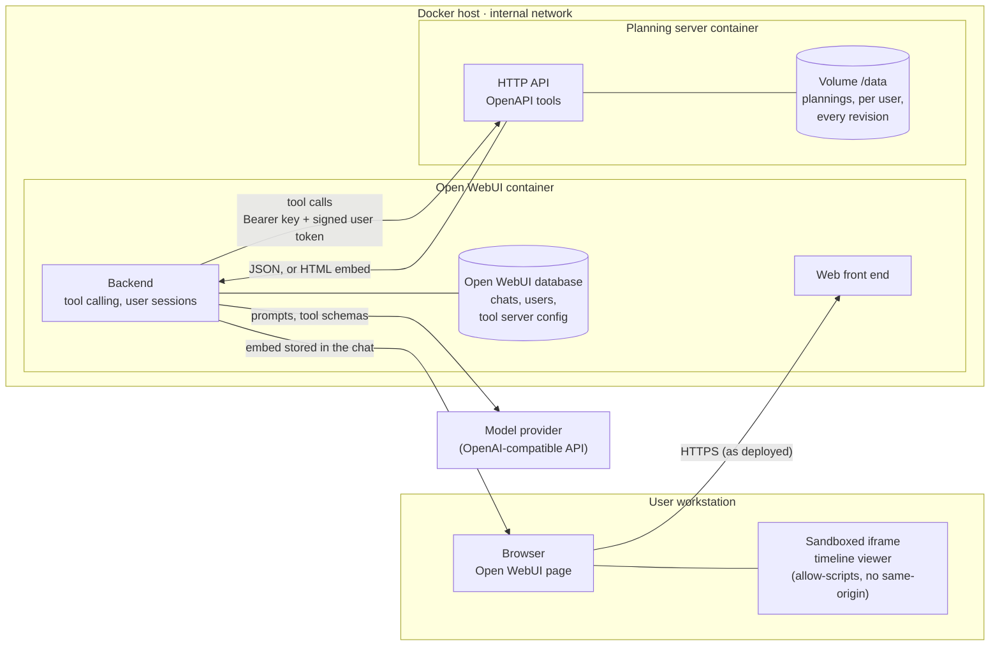
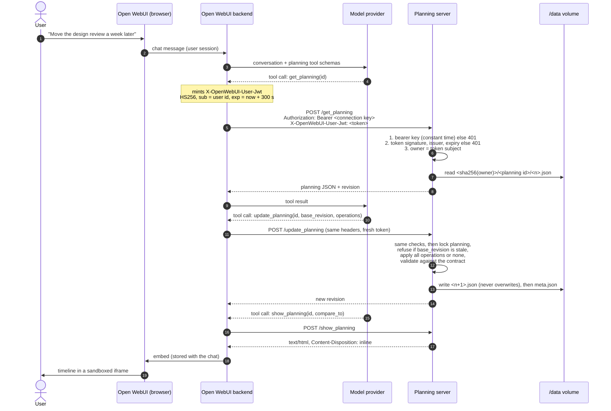
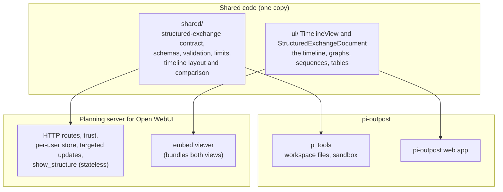

# Planning server for Open WebUI — architecture and security

The architecture of the planning server: its components, how it talks to Open WebUI, what it trusts
and why, how tokens and keys are handled, and what it stores. Installation is described in
[openwebui.md](openwebui.md).

Checked against **Open WebUI v0.11.4**.

## In one paragraph

- **What it is:** a stateless HTTP service, one Node process in one container, with one volume. It
  receives tool calls from Open WebUI's backend, stores each user's plannings as files, and answers
  with JSON or with an HTML page that Open WebUI shows inside a sandboxed frame.
- **Showing a diagram:** `show_structure` validates a structured document (a graph, a sequence, a
  table, a timeline, or a proposal) and answers with that page. It stores nothing.
- **What it never does:** it opens no outbound connection, calls no model, holds no user password,
  and reads no other data from Open WebUI. Only Open WebUI's backend needs to reach it, so it
  publishes no port.

## Components



- **Arrows that do not exist:**
  - nothing goes from the browser to the planning server;
  - nothing goes from the planning server to Open WebUI, the model provider or the internet.
- **The embed:** the browser shows the timeline because Open WebUI stored it in the chat and hands
  it to its own page, which puts it in a sandboxed frame.

## A tool call, end to end



## Trust model

**Two secrets, two different questions:**

| Secret | Set in | Proves | Without it |
|---|---|---|---|
| Connection bearer key (`OWUI_PLANNING_SECRET`) | the tool server connection in Open WebUI, and the planning server | that the caller is Open WebUI | every request is refused with 401 before anything else is read, including the API description |
| Identity signing key (`OWUI_PLANNING_IDENTITY_KEY` = Open WebUI's `FORWARD_USER_INFO_HEADER_JWT_SECRET`) | Open WebUI and the planning server | which user Open WebUI acts for | in signed mode, no request can name a user; the server refuses to start without it |

**Order of checks**, enforced in one hook that runs before any route:
1. the bearer key, compared in constant time;
2. the user token's signature (HS256 only, no algorithm negotiation), its issuer (`open-webui`),
   and its expiry (300 s, 30 s of clock tolerance);
3. only then the request body, and the planning it names.

A refused request never reaches the code that reads or writes plannings.

**Why the user is signed, not merely forwarded:**
- Open WebUI can also forward the user as plain headers (`X-OpenWebUI-User-Id`, …). A plain header
  is a claim, which only the bearer key vouches for.
- The signed token binds the user to a key that only Open WebUI holds, and it expires, so a request
  captured from a log cannot be replayed for long.
- In signed mode, plain identity headers are ignored, so a request cannot choose whose plannings it
  touches. Plain mode exists for an Open WebUI that cannot be given the signing key; it is not the
  default.

**Plannings are personal:**
- Every read and write is scoped to the token's subject.
- Another user's planning answers exactly as a planning that does not exist (404, same message), so
  its existence is not disclosed.
- Team sharing does not exist yet.

## Token and key management

| Item | Lifetime | Rotation |
|---|---|---|
| User token (`X-OpenWebUI-User-Jwt`) | 300 s, minted by Open WebUI for each call (`FORWARD_USER_INFO_HEADER_JWT_EXPIRES_SECONDS`) | none: short-lived by design |
| Identity signing key | until rotated | change `FORWARD_USER_INFO_HEADER_JWT_SECRET` and `OWUI_PLANNING_IDENTITY_KEY` together, then restart both containers. Calls in flight during the restart fail and are retried by the user. |
| Connection bearer key | until rotated | change it in *Admin Settings → Integrations → External Tool Servers* (or `TOOL_SERVER_CONNECTIONS` before first start) and in `OWUI_PLANNING_SECRET`, then restart the planning server |

**Key requirements:**
- Generate both keys with `openssl rand -hex 32` and keep them out of images and repositories (a
  `.env` file with mode 600, or the orchestrator's secret store).
- Open WebUI applies its signing key to **every** backend it forwards users to, not only this
  server. A deployment that already uses `FORWARD_USER_INFO_HEADER_JWT_SECRET` reuses the same key here.

The planning server never sees a user's password, Open WebUI session or API key: Open WebUI sends it
only the connection key and the short-lived token.

## What reaches the browser

The timeline, or any structure shown, is HTML that Open WebUI renders in an iframe with
`sandbox="allow-scripts allow-popups allow-downloads"` and **no** `allow-same-origin`. The frame has
an opaque origin:
- it cannot read Open WebUI's page, cookies or storage;
- it cannot call Open WebUI's API as the user.

**What the page does:**
- It loads nothing: the viewer, its stylesheet and the planning are inside it, compressed. The
  browser never contacts the planning server.
- It sends Open WebUI two kinds of messages:
  - its height;
  - a request to **pre-fill** the chat input when the user clicks a task or a milestone of a
    planning.

  It never asks Open WebUI to send a message, and nothing on it applies a proposal.
- **Downloads:** a reader downloads a diagram (SVG) or a table (Markdown, CSV, XLSX). The file is
  built in the frame and saved through `allow-downloads`; nothing is fetched.
- **Planning content is data, never markup.** Labels and titles are rendered as text by React. A
  planning titled `</script><script>…` is stored as typed and shown as typed, and the page around
  it still holds a single script, the viewer's own. This is tested.

## What is stored, and where

```
/data/<sha256(user id)>/<planning id>/meta.json     title, current revision, dates
/data/<sha256(user id)>/<planning id>/1.json        each revision, a complete document
                                     /2.json …
```

- **Contents:** only what users put in their plannings (titles, labels, dates, dependencies), plus
  timestamps. No name, e-mail or role is stored: the user appears only as the SHA-256 of their Open
  WebUI id. That is pseudonymous, not anonymous; Open WebUI can map it back.
- **History:**
  - every change adds a revision file, written once (`wx`) and never modified;
  - `meta.json` is replaced atomically (temporary file, then rename);
  - updates to one planning are serialised, and an update prepared against an old revision is
    refused, so two users or two chats cannot overwrite each other silently.
- **Encryption at rest** is the volume's: the files are plain JSON.
- **Deleting a user's plannings:** remove `/data/<sha256(user id)>`. There is no deletion tool for
  users yet.
- **Backups and restore** are a copy of the volume. Every revision file opens in pi-outpost as it
  is.

**What Open WebUI stores:** each time a planning is shown, the embed (about 110 kB, compressed
viewer and planning) is stored in the chat, in Open WebUI's database. Deleting the chat deletes it.

## Limits enforced by the server

| Limit | Default | Setting |
|---|---|---|
| Planning size | 1 MB of JSON | `OWUI_PLANNING_MAX_BYTES` |
| Revisions per planning | 500, after which updates are refused rather than history pruned | `OWUI_PLANNING_MAX_REVISIONS` |
| Plannings per user | 200 | `OWUI_PLANNING_MAX_PLANNINGS` |
| Request body | twice the planning size, plus 64 kB | derived |

Malformed input is refused with the reason (400, 413, 422); nothing is partially applied.

## Supply chain

- **Image:** `ghcr.io/laurentftech/pi-outpost-plannings:<version>` contains `node:24-slim` and two
  artefacts. It is built by the project's release workflow from the release tag, after the full test
  suite, and checked by `openwebui/test/image.sh` before it is pushed. It runs as the unprivileged
  `node` user.
  - `dist/server.mjs`: the server, bundled into one file with its dependencies (Fastify, and the
    project's structured-exchange contract);
  - `dist/viewer/`: the timeline viewer.
- **No `node_modules`:** none at run time, and no package is installed when the container starts.
- **Rebuilding internally:** the image can be rebuilt from the repository, for a mirror registry:

  ```bash
  docker build -f openwebui/Dockerfile -t pi-outpost-plannings .
  ```
- **Logging:** the server logs its start-up line and nothing else, no request content.

## One code base, two hosts

The planning server is not a second implementation. It is a thin adapter around the code
pi-outpost already uses:



- **Shared, for both hosts:**
  - **the contract:** what a valid document is, of every kind, the diagnostics, and the limits;
  - **the drawing:** layouts, viewpoints, the proposal view, exports, the timeline's scales and
    comparison.

  A change to a drawing or to the validation reaches both hosts at the next release.
- **The adapter's own:**
  - the trust boundary;
  - per-user storage with revisions;
  - the targeted update operations;
  - the tool descriptions written for Open WebUI's models.
