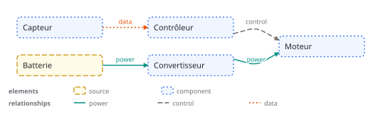
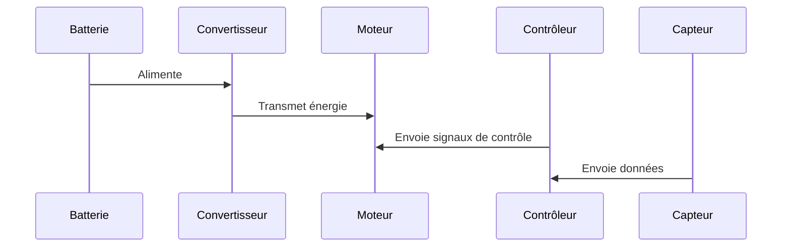

# Architecture d'un modèle électrique

## Description

Ce document décrit l'architecture d'un modèle électrique composé des éléments suivants :

- **Batterie** : Source d'énergie
- **Convertisseur** : Composant de conversion d'énergie
- **Moteur** : Composant de propulsion
- **Contrôleur** : Composant de contrôle
- **Capteur** : Composant de détection

## Diagramme

## Flux d'énergie et de données

1. La batterie alimente le convertisseur.
2. Le convertisseur transmet l'énergie au moteur.
3. Le contrôleur envoie des signaux de contrôle au moteur.
4. Le capteur envoie des données au contrôleur.

## Conclusion

Cette architecture permet une gestion efficace de l'énergie et du contrôle du modèle électrique.

## Diagramme de séquence

