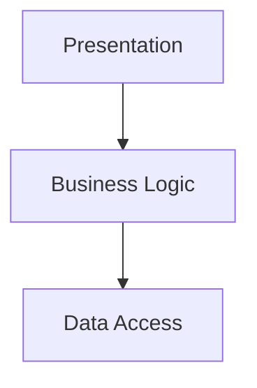

# Architecture Specification

> Generated by openlore v1.0.0 on 2026-07-11 03:51

## Purpose

This document describes the architectural patterns and structure of the system.

## Architecture Style

Layered architecture: The system is organized into layers with clear responsibilities, including
presentation, business logic, and data access. This pattern is chosen to promote separation of
concerns, modularity, and ease of maintenance.

## Requirements

### Requirement: LayeredArchitecture

The system SHALL maintain separation between:
- Presentation (Handles user interface and user interaction)
- Business Logic (Contains the core functionality and business rules)
- Data Access (Manages data storage and retrieval)

#### Scenario: LayerSeparation
- **GIVEN** a request from the presentation layer
- **WHEN** business logic is needed
- **THEN** the presentation layer delegates to the business layer
- **AND** direct database access from presentation is prohibited

### Requirement: SecurityModel

The system SHALL implement security via: Authentication and authorization are not explicitly mentioned in the analysis, but it is likely that JWT Bearer tokens or similar mechanisms are used for securing the WebSocket connections and other endpoints.

#### Scenario: AuthenticatedAccess
- **GIVEN** an unauthenticated request
- **WHEN** accessing protected resources
- **THEN** access is denied

## System Diagram

## Layer Structure

### Presentation

**Purpose**: Handles user interface and user interaction
**Location**: `web/src/useTheme.ts, web/src/useAgent.ts, web/src/components/CodeHighlight.tsx, web/src/components/Composer.tsx, embed/src/mount.tsx`

### Business Logic

**Purpose**: Contains the core functionality and business rules
**Location**: `server/src/sandbox.ts, server/src/config.ts, server/src/index.ts, server/src/sandbox.ts`

### Data Access

**Purpose**: Manages data storage and retrieval
**Location**: `server/src/config.ts`

## Data Flow

HTTP request → route handler → service → repository → data store; WebSocket messages → WebSocket
handler → service → agent backend; async message processing via event-driven architecture

## External Integrations

| System | Purpose |
|--------|---------|
| WebSocket | External integration |
| Agent Backend | External integration |
| File System | External integration |
