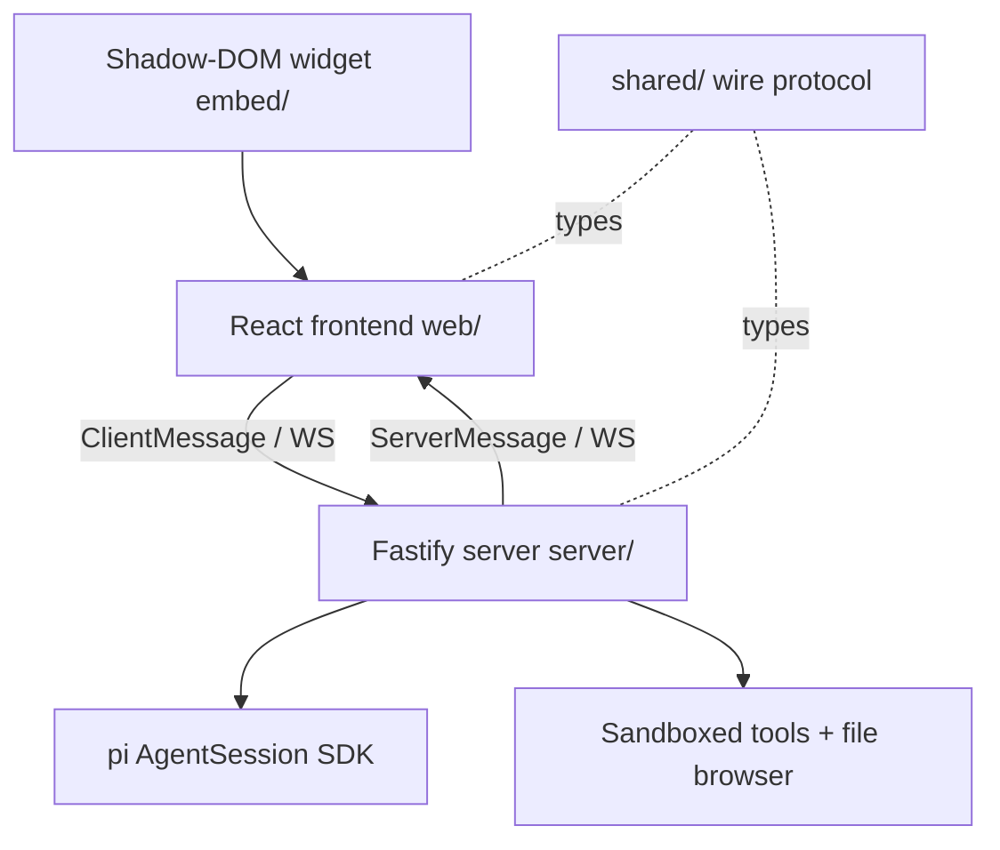

# Architecture Specification

> Generated by openlore v1.0.0 on 2026-07-11 03:51
> Reviewed & corrected by hand on 2026-07-11

## Purpose

This document describes the architectural patterns and structure of the system.

## Architecture Style

Client/server over a typed WebSocket protocol. A Fastify server (`server/`) embeds a single
pi AgentSession and broadcasts its events to every connected client; the React frontend
(`web/`) is a pure view over that protocol. The shared package (`shared/`) defines the wire
protocol both sides compile against. An embed package (`embed/`) wraps the frontend in a
Shadow-DOM widget for host applications.

## Requirements

### Requirement: LayeredArchitecture

The system SHALL maintain separation between:
- Frontend (React components + `useAgent` state; renders ChatItems, never talks to the pi SDK directly)
- Wire protocol (`shared/src/protocol.ts`; single source of truth for ClientMessage/ServerMessage)
- Server (WebSocket handler, config, sandbox, file browser; the only layer that touches the pi SDK and the file system)

#### Scenario: LayerSeparation
- **GIVEN** a user action in the frontend
- **WHEN** agent work is needed
- **THEN** the frontend sends a ClientMessage over the WebSocket
- **AND** direct pi SDK or file-system access from the frontend is prohibited

### Requirement: SecurityModel

The system SHALL implement security without authentication, via network scoping and sandboxing:
- The server binds to 127.0.0.1 by default (`server.host` config to override deliberately)
- WebSocket upgrades are rejected unless the Origin is localhost/127.0.0.1 or an exact match in `server.allowedOrigins`
- When a sandbox is configured, built-in file tools are replaced by scoped ones confined to `sandbox.root` (writes further confined to `sandbox.writableRoot`, bash off by default)
- Session switching only accepts paths returned by the SessionManager listing (no arbitrary file paths)

#### Scenario: CrossOriginRejected
- **GIVEN** a WebSocket upgrade with an Origin not in the allowlist
- **WHEN** the connection is attempted
- **THEN** the server rejects the upgrade

#### Scenario: SandboxedFileAccess
- **GIVEN** a configured sandbox root
- **WHEN** an agent tool tries to read or write outside that root (including via symlinks)
- **THEN** the tool call fails with an error

## System Diagram

## Layer Structure

### Frontend

**Purpose**: Renders the conversation and UI, holds client state
**Location**: `web/src/useAgent.ts`, `web/src/useTheme.ts`, `web/src/App.tsx`, `web/src/components/`, `embed/src/mount.tsx`

### Server

**Purpose**: Owns the AgentSession, enforces config/sandbox, serves the WebSocket and HTTP endpoints
**Location**: `server/src/index.ts`, `server/src/convert.ts`, `server/src/config.ts`, `server/src/sandbox.ts`, `server/src/fileBrowser.ts`

### Wire Protocol

**Purpose**: Typed messages shared by both sides
**Location**: `shared/src/protocol.ts`

## Data Flow

Client ClientMessage → WebSocket handler (`server/src/index.ts`) → AgentSession runtime →
agent events converted to ChatItems (`server/src/convert.ts`) → ServerMessage broadcast to
all connected clients → `useAgent` reducer updates React state.

## External Integrations

| System | Purpose |
|--------|---------|
| pi coding agent SDK | Embedded AgentSession (models, tools, extensions, sessions) |
| Model provider APIs | LLM calls, made through the SDK |
| File System | Sandboxed agent tools, file browser, session storage |
