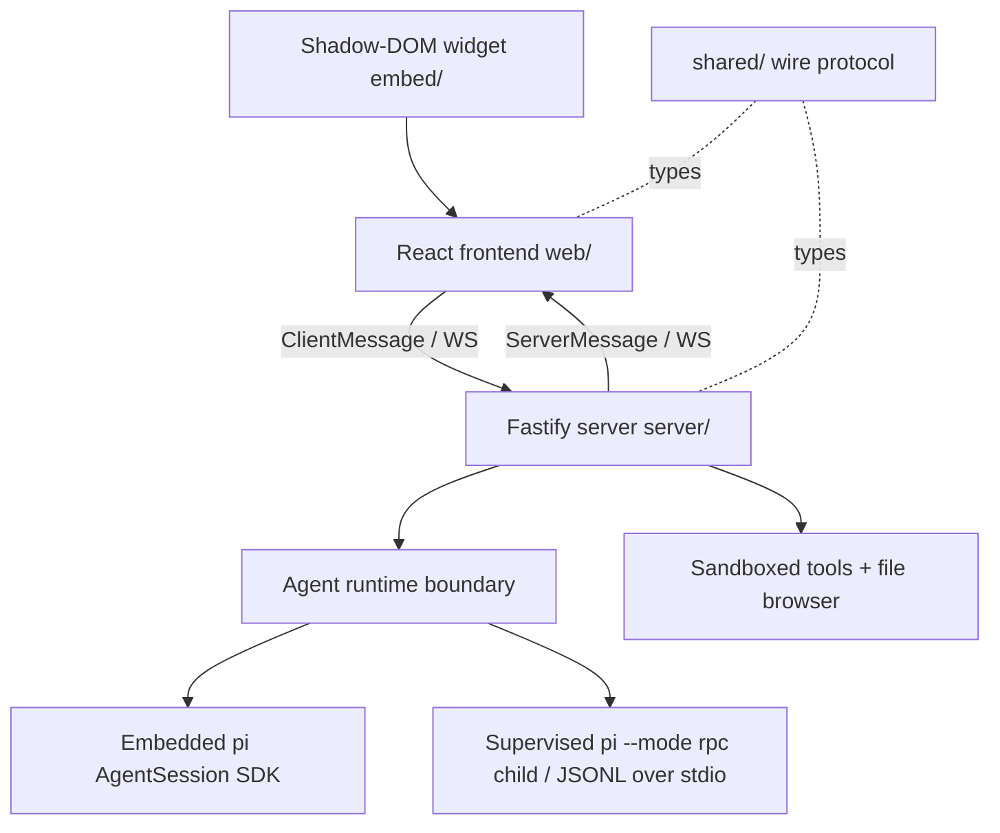

# Architecture Specification

> Generated by openlore v1.0.0 on 2026-07-11 03:51
> Reviewed & corrected by hand on 2026-07-11

## Purpose

This document describes the architectural patterns and structure of the system.

## Architecture Style

Client/server over a typed WebSocket protocol. A Fastify server (`server/`) owns a single agent
runtime and broadcasts its events to every connected client; the React frontend (`web/`) is a pure
view over that protocol. The runtime is either an embedded pi AgentSession in the server's own
process or a supervised `pi --mode rpc` child — one boundary (`server/src/agentRuntime.ts`) serves
both, and which one is running is invisible to the frontend. The shared package (`shared/`) defines
the wire protocol both sides compile against. An embed package (`embed/`) wraps the frontend in a
Shadow-DOM widget for host applications.

## Requirements

### Requirement: LayeredArchitecture

The system SHALL maintain separation between:
- Frontend (React components + `useAgent` state; renders ChatItems, never talks to the pi SDK directly)
- Wire protocol (`shared/src/protocol.ts`; single source of truth for ClientMessage/ServerMessage)
- Server (WebSocket handler, config, sandbox, file browser; the only layer that touches the pi SDK and the file system)

The server SHALL hold zero or more workspaces, each owning one agent session and the resources rooted at that workspace's directory. Each client connection is bound to exactly one workspace, and the server routes messages by that binding rather than broadcasting to every client.

#### Scenario: LayerSeparation
- **GIVEN** a user action in the frontend
- **WHEN** agent work is needed
- **THEN** the frontend sends a ClientMessage over the WebSocket
- **AND** direct pi SDK or file-system access from the frontend is prohibited

#### Scenario: WorkspaceOwnsItsResources
- **GIVEN** a server holding several workspaces
- **WHEN** one of them rebuilds its toolset or moves its root
- **THEN** the other workspaces' sessions, roots, watchers and toolsets are unaffected

### Requirement: SecurityModel

The system SHALL implement security via network scoping, an optional shared token, and sandboxing:
- The server binds to 127.0.0.1 by default (`server.host` config to override deliberately)
- WebSocket upgrades are rejected unless the Origin is localhost/127.0.0.1 or an exact match in `server.allowedOrigins`
- When a token is configured (`server.token` / `PI_OUTPOST_TOKEN`), the WebSocket and the HTTP API additionally require it (timing-safe comparison); binding beyond localhost without a token is the operator's explicit choice
- When a sandbox is configured, built-in file tools are replaced by scoped ones confined to `sandbox.root` (writes further confined to `sandbox.writableRoot`, bash off by default). Pi's own built-in tools that the sandbox does not replace are not registered in the session at all, so neither an extension nor a setting can activate an unconfined one; a sandboxed session that would still register one fails to start. A sandbox is scoped to the workspace it belongs to: a workspace's tools are confined to that workspace's root, never to another workspace's
- A client may open a workspace at any server-side path it can reach through the directory picker, exactly as it may already move the sandbox root there; the boundary is the configured lock, not an enumeration of allowed roots. A workspace opened this way is sandboxed at its own root like any other
- Session switching only accepts paths returned by the SessionManager listing (no arbitrary file paths), and only from the session manager of the workspace the connection is bound to

#### Scenario: CrossOriginRejected
- **GIVEN** a WebSocket upgrade with an Origin not in the allowlist
- **WHEN** the connection is attempted
- **THEN** the server rejects the upgrade

#### Scenario: TokenRequired
- **GIVEN** a configured token
- **WHEN** a WebSocket connects without it (or /branding is fetched without the bearer header)
- **THEN** the connection is closed with an auth-failure code (or 401 returned) before any agent data flows

#### Scenario: SandboxedFileAccess
- **GIVEN** a configured sandbox root
- **WHEN** an agent tool tries to read or write outside that root (including via symlinks)
- **THEN** the tool call fails with an error

#### Scenario: UnconfinedBuiltInsAreNotRegistered
- **GIVEN** a sandbox that withholds a tool Pi has built in (`bash` without `allowBash`, `write` and `edit` in a read-only sandbox)
- **WHEN** an extension asks the session to activate that tool
- **THEN** the tool is neither active nor registered, and the sandbox's own confined tools are unaffected

#### Scenario: OpeningAWorkspaceUnderALock
- **GIVEN** a configuration that forbids opening projects
- **WHEN** a client asks to open a directory as a workspace
- **THEN** it is refused, and no session or sandbox is created for that path

#### Scenario: ANewWorkspaceIsSandboxedAtItsOwnRoot
- **GIVEN** a sandboxed server
- **WHEN** a client opens a directory as a new workspace
- **THEN** that workspace's tools are confined to that directory, not to the one the server started in

#### Scenario: SessionsCannotBeOpenedAcrossWorkspaces
- **GIVEN** a connection bound to workspace A
- **WHEN** it asks to open a session file belonging to workspace B
- **THEN** the request is refused

### Requirement: AgentRuntimeBoundary

The server SHALL own a single agent-runtime boundary that translates between the typed web protocol
and either an embedded Pi SDK session or a configured Pi RPC subprocess. The frontend SHALL remain
unaware of the selected runtime and SHALL not gain direct process or Pi protocol access.

The runtime boundary SHALL preserve the server's ownership of browser authentication, origin checks,
file-browser operations, and client broadcasting. Selecting RPC SHALL not expose the RPC standard
streams on the network.

#### Scenario: BrowserProtocolIsRuntimeIndependent
- **GIVEN** the server starts with either supported runtime
- **WHEN** the frontend sends a supported agent message
- **THEN** it uses the same typed WebSocket contract and receives the same category of observable state

#### Scenario: RpcStdioIsNotNetworkAccessible
- **GIVEN** the server runs a Pi RPC subprocess
- **WHEN** a remote network client connects to pi-outpost
- **THEN** it cannot connect directly to Pi's standard input or output

## System Diagram

```mermaid
graph TB
    Web[React frontend web/] -->|ClientMessage / WS| Server[Fastify server server/]
    Embed[Shadow-DOM widget embed/] --> Web
    Server -->|ServerMessage / WS| Web
    Server --> Runtime[Agent runtime boundary]
    Runtime --> SDK[Embedded pi AgentSession SDK]
    Runtime --> RPC[Supervised pi --mode rpc child / JSONL over stdio]
    Server --> Sandbox[Sandboxed tools + file browser]
    Shared[shared/ wire protocol] -.types.- Web
    Shared -.types.- Server
```

## Layer Structure

### Frontend

**Purpose**: Renders the conversation and UI, holds client state
**Location**: `web/src/useAgent.ts`, `web/src/useTheme.ts`, `web/src/App.tsx`, `web/src/components/`, `embed/src/mount.tsx`

### Server

**Purpose**: Owns the agent runtime, enforces config/sandbox, serves the WebSocket and HTTP endpoints
**Location**: `server/src/index.ts`, `server/src/agentRuntime.ts`, `server/src/embeddedRuntime.ts`, `server/src/rpcRuntime.ts`, `server/src/piRpcProcess.ts`, `server/src/convert.ts`, `server/src/config.ts`, `server/src/sandbox.ts`, `server/src/fileBrowser.ts`

### Wire Protocol

**Purpose**: Typed messages shared by both sides
**Location**: `shared/src/protocol.ts`

## Data Flow

Client ClientMessage → WebSocket handler (`server/src/index.ts`) → agent-runtime boundary
(`server/src/agentRuntime.ts`), served by the embedded SDK session or the RPC child →
runtime events converted to ChatItems (`server/src/convert.ts`) → ServerMessage broadcast to
all connected clients → `useAgent` reducer updates React state.

## External Integrations

| System | Purpose |
|--------|---------|
| pi coding agent SDK | Embedded AgentSession (models, tools, extensions, sessions); also the session store and credential status under the RPC runtime |
| pi executable | Optional supervised `pi --mode rpc` child, spoken to as LF-delimited JSONL over stdio |
| Model provider APIs | LLM calls, made by whichever runtime is active |
| File System | Sandboxed agent tools, file browser, session storage |
